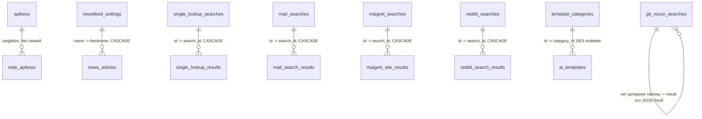

# Аудит схемы БД + документирование: практики и план

Разбор того, как сейчас устроена база данных Corvid (SQLAlchemy 2.0 async + Alembic), что с ней не так на уровне
нейминга/типов/целостности, и как в open source обычно документируют и автоматизируют это, чтобы схема не
превращалась в чёрный ящик для контрибьюторов.

Прочитаны все 27 файлов моделей (`backend/app/**/models/*.py`), все 16 миграций (`backend/migrations/versions/`),
`backend/app/core/database.py`, `backend/migrations/env.py`, `backend/main.py`, `backend/docker-entrypoint.py`,
`backend/app/core/security/secrets_crypto.py`. Все находки ниже привязаны к конкретным файлам/строкам.

---

## TL;DR

Схема для соло-проекта в целом опрятная: миграции написаны аккуратно (idempotent-проверки, `batch_alter_table` для
SQLite, реализованный `downgrade()` почти везде), паттерн `Search` + `SearchResult` с FK `ondelete="CASCADE"`
переиспользуется в 4 фичах почти одинаково. Но есть один действительно опасный баг и одна системная проблема:

1. **FK-каскады не работают вообще** — SQLite по умолчанию не проверяет foreign keys, `PRAGMA foreign_keys=ON`
   нигде не включён, а весь код полагается на `ondelete="CASCADE"` + `passive_deletes=True`. Каждое удаление
   поиска оставляет осиротевшие строки в `*_results`. Это не гипотетика — БД по умолчанию именно SQLite.
2. **`migrations/env.py` не импортирует 17 из 27 моделей** → `alembic revision --autogenerate` не видит их и может
   сгенерировать миграцию, которая дропает существующие таблицы, думая, что их не должно быть.
3. **Схемы у проекта нет вообще как документа** — ни ER-диаграммы, ни data dictionary, ни упоминания БД в README.
   Всё восстанавливается только чтением 27 файлов моделей, что и пришлось сделать для этого отчёта.

Дальше — подробности.

---

## 1. Как сейчас устроено

- **ORM**: SQLAlchemy 2.0, `Mapped[...]` / `mapped_column`, async engine (`backend/app/core/database.py`).
- **СУБД по умолчанию**: SQLite (`sqlite:///./data/corvid.db`), WAL-режим (`PRAGMA journal_mode=WAL`,
  `synchronous=NORMAL`, `database.py:53-54`). PostgreSQL поддерживается как опция через `asyncpg`
  (`_to_async_url`, `database.py:20-28`), но, судя по коду, никем реально не тестируется — это self-hosted
  single-operator инструмент, и PostgreSQL выглядит как "на будущее", а не как проверенный путь.
- **Миграции**: Alembic, 16 файлов в `backend/migrations/versions/`, линейная история (нет веток/merge).
- **Создание схемы — двойной механизм**:
  - `backend/docker-entrypoint.py`: на пустой БД делает `alembic stamp head` (без DDL), на непустой —
    `alembic upgrade head`.
  - `backend/main.py:52-70` (`_create_database_tables`): при каждом старте вызывает
    `Base.metadata.create_all()`, создавая любые таблицы, которых ещё нет.
  - Итог: на **первом** запуске реальную схему создаёт не Alembic, а `create_all()` — Alembic только помечает
    БД как актуальную (`stamp head`), не выполняя ни одной миграции. Задокументировано прямо в
    `docker-entrypoint.py:18-22`, это осознанное решение, а не забытый баг — но это нетипичный паттерн, который
    стоит явно объяснить в docs, иначе новый контрибьютор решит, что Alembic просто не работает.
  - `_create_database_tables()` вручную импортирует **только 13 из 27** модулей моделей (`main.py:54-66`).
    Реально это не баг: `main.py` уже импортировал `router_registry`, который транзитивно тянет все
    роутеры → все CRUD → все модели, так что `Base.metadata` к моменту вызова содержит все 27 таблиц. Но это
    неявная зависимость от порядка импортов — рефакторинг `router_registry` на ленивые импорты молча сломает
    создание части таблиц на чистой установке. Список импортов создаёт ложное впечатление "вот эти 13 таблиц
    поддерживаются", хотя на самом деле поддерживаются все.
- **Секреты**: `Apikey.key` шифруется прозрачно через кастомный `TypeDecorator` (`EncryptedString`,
  `api_keys_settings_models.py:13-27`) поверх Fernet (AES-128-CBC+HMAC), ключ — из
  `SECURITY_ENCRYPTION_KEY` или автогенерируется в `<data_dir>/.encryption_key` (`secrets_crypto.py`). Это
  единственное зашифрованное поле во всей схеме.

---

## 2. Полная карта таблиц

### Кластер настроек (`core/settings/**`, почти все — singleton-таблицы с одной строкой)

| Таблица | PK | Ключевые поля | Примечания |
|---|---|---|---|
| `general_settings` | `id: int` | `darkmode`, `language: String(N)`, `start_screen`, `always_tiles` | нет `created_at`/`updated_at` |
| `module_settings` | `name: String` **(натуральный ключ, без длины!)** | `enabled: bool` | |
| `api_keys_settings` → `apikeys` | `name: String(100)` (натуральный ключ) | `key: EncryptedString`, `is_active`, `bulk_ioc_lookup`, `created_at`, `updated_at` | единственная таблица с шифрованием |
| `keywords` | `id: int` | `keyword: String(100) unique` | есть `created_at`/`updated_at` |
| `ai_settings` | `id: int` | 4× `String(80)` название модели | singleton, нет timestamps |
| `cti_profile_settings` | `id: int` | `settings_data: Text` (**JSON, упакованный в строку вручную**) | `created_at`/`updated_at` есть |
| `email_search_config` | `id: int` | `timeout_seconds`, `proxy_url`, `use_tor`, `latest_pypi_version`, `pypi_checked_at` | |
| `social_analyzer_config` | `id: int` | `timeout_seconds`, `top_sites_count`, pypi-поля | |
| `username_search_config` | `id: int` | то же + `auto_update_*`, `db_last_updated_at`, `db_site_count` | |

### Alerts

| `alerts` | `id: int` | `module`, `title`, `message`, `read: bool`, `timestamp`, `timestamp_read` |

### IOC tools

| `blacklisted_addresses` | `id: int` | `address(128)`, `source(20)`, `chain`, `label`, `entity_name`, `details: JSON`, `is_active`, `first_seen_at`, `last_seen_at` — `UNIQUE(address, source)` |
| `single_lookup_searches` | `id: int` | `ioc(2000)`, `ioc_type(20)`, `searched_at` |
| `single_lookup_results` | `id: int` | FK → `single_lookup_searches.id` CASCADE, `service_key`, `service_name`, `status`, `summary`, `tlp`, `data: JSON` |

### Email search (mailcat)

| `mail_searches` | `id: int` | `username(100)`, `status(20)`, `total_providers_checked`, `found_count`, `error_message`, `started_at`, `completed_at` |
| `mail_search_results` | `id: int` | FK CASCADE → `mail_searches.id`, `provider_name(200)`, `emails: JSON`, `extra: JSON` |

### Username search (maigret + social-analyzer)

| `maigret_searches` | `id: int` | `username(100)`, `source(30)` default `"maigret"`, `status(20)`, `total_sites_checked`, `found_count`, `error_message`, `tags: JSON`, `started_at`, `completed_at` |
| `maigret_site_results` | `id: int` | FK CASCADE → `maigret_searches.id`, `site_name(200)`, `url_user(2000)`, `http_status`, `extra: JSON` |

### Reddit search

| `reddit_searches` | `id: int` | `username(100)`, `subreddit_filter`, `date_from/to: Integer` (unix-время как `int`, не `DateTime`), `include_nsfw`, `searched_at` |
| `reddit_search_results` | `id: int` | FK CASCADE, `UNIQUE(search_id, kind, reddit_id)`, `kind(10)`, `reddit_id(20)`, `subreddit(100)`, `title/body: Text`, `score`, `num_comments`, `permalink(500)`, `created_utc: Integer` (тоже unix-время), `over_18`, `removed`, `deleted`, `extra: JSON` |

### Git recon

| `git_recon_searches` | `id: int` | `mode(20)`, `target(300)`, `status(20)`, `error: Text`, `repos_scanned`, `repos_failed`, `persons_found`, `searched_at`, `result: JSON` — **единственная фича без дочерней result-таблицы**, весь результат — один JSON-блоб |

### Newsfeed

| `newsfeed_settings` | `name: String` (натуральный ключ, без длины) | `url`, `icon`, `icon_id: uuid str`, `enabled`, `deleted` (**soft delete**, единственный в схеме), `last_fetched_at`, `last_success_at`, `last_error` |
| `news_articles` | `id: int` | FK → `newsfeed_settings.name` CASCADE, `icon`, `title`, `summary`, `full_text` — **все `String` без длины**, `date`, `link unique`, `fetched_at`, `matches: JSON`, `iocs: JSON`, `relevant_iocs: JSON`, `analysis_result: Text`, `mitre_attack: Text`, `note: Text`, `tlp` default `"TLP:CLEAR"`, `read` |
| `newsfeed_config` | `id: int` | `retention_days`, `background_fetch_enabled`, `fetch_interval_minutes`, `last_fetch_timestamp`, `keyword_matching_enabled` |
| `trends_blacklist` | `id: int` | `UNIQUE(value, type)`, `value(255)`, `type(10)` (`word`/`ioc` — валидируется в Python, не в БД) |

### LLM templates

| `template_categories` | `id: str (uuid)` | `name(100)`, `order_number`, `is_system`, `created_at` |
| `ai_templates` | `id: str (uuid)` | FK → `template_categories.id` (**без `ondelete`!**), `title(200)`, `description/example/agent_role/agent_task: Text`, `payload_fields: JSON`, `static_contexts/web_contexts: JSON`, `is_public`, `user_id(100)` (**не FK, произвольная строка**), `order_number`, `temperature: Float`, `model(100)` |

### ER-связи (родитель → потомок)

Все FK, кроме `ai_templates.category_id`, — `ondelete="CASCADE"` с `passive_deletes=True` на стороне ORM. Реально
работающих (то есть проверяемых на уровне СУБД) среди них — **ноль** на дефолтном SQLite-бэкенде, см. находку №1.

---

## 3. Находки

Отсортировано по серьёзности внутри категорий.

### Критические

**№1. FK-каскады не работают на SQLite — источник orphan-строк.**
`backend/app/core/database.py:39-55` создаёт SQLite-движок и включает WAL, но нигде не выполняет
`PRAGMA foreign_keys=ON`. SQLite по умолчанию **не проверяет** внешние ключи и не выполняет `ON DELETE CASCADE`
без этого прагма. При этом код в CRUD-слое явно полагается на серверный каскад:
`email_search_crud.py:142`, `username_search_crud.py:146`, `reddit_search_crud.py:96` делают `await db.delete(search)`
без явного удаления дочерних строк, а модели объявлены с `passive_deletes=True` (например
`username_search_models.py:25-27`) — это прямая инструкция SQLAlchemy "не удаляй дочерние строки сам, доверься
БД". БД не удаляет. Итог: каждое удаление поиска в username_search/email_search/reddit_search оставляет
осиротевшие `*_site_results`/`*_search_results` строки, которые никогда не будут собраны, и БД тихо растёт.
`single_lookup` и `newsfeed` подвержены тому же.
**Фикс**: добавить `PRAGMA foreign_keys=ON` в `_set_sqlite_pragma` (`database.py:48-55`), и **обязательно**
разовый скрипт очистки существующих orphan-строк в проде (у пользователей, которые уже удаляли записи).

**№2. `migrations/env.py` не видит 17 из 27 моделей — `autogenerate` небезопасен.**
`backend/migrations/env.py:10-19` явно импортирует только 10 классов моделей. Отсутствуют: все модели
`email_search`, `username_search`, `reddit_search`, `git_recon`, `single_lookup` (кроме blacklist),
`ai_settings`, `email_search`/`username_search`/`social_analyzer` settings. `target_metadata = Base.metadata`
(`env.py:26`) наполняется только тем, что реально импортировано в процессе — а в контексте `alembic revision
--autogenerate` (отдельный CLI-процесс, не `main.py`) ничего, кроме `env.py`, эти модули не импортирует. Значит
Alembic **не увидит** эти 17 таблиц и при следующей автогенерации либо ничего не предложит для них, либо (что
хуже) сгенерирует `op.drop_table(...)` для них, решив, что раз их нет в metadata — их не должно быть в БД.
**Фикс**: заменить ручной список импортов на автообнаружение (например `pkgutil.walk_packages` по
`app/**/models`) или хотя бы синхронизировать список с `main.py:54-66` + добавить недостающие 14.

### Высокая серьёзность

**№3. Нет retention/очистки для истории поисков.**
`newsfeed_config.retention_days` (`newsfeed_models.py:61`) — единственное поле retention во всей схеме, и
только для новостей. У `mail_searches`, `maigret_searches`, `reddit_searches`, `git_recon_searches`,
`single_lookup_searches` нет ни поля retention, ни scheduler job (в `app/core/scheduler.py` job'ы только для
news fetch и blacklist refresh). Для OSINT-инструмента, хранящего email/username/reddit-контент/git-identity без
ограничения по времени, это и вопрос роста БД, и вопрос данных: сколько чужих персональных данных лежит в базе
бессрочно.
**Фикс**: как минимум задокументировать это как осознанное решение ("история поисков — фича, retention не
предусмотрен"), как максимум — добавить опциональный retention по аналогии с newsfeed.

**№4. `ai_templates.category_id` без `ondelete`.**
`llm_template_models.py:73-76` — единственный FK в схеме без `ondelete`. При удалении `TemplateCategory`
поведение по умолчанию SQLite/SQLAlchemy — `NO ACTION`/ошибка на уровне БД, если FK вообще включены (см. №1); а
поскольку они не включены — удаление категории просто оставит `ai_templates.category_id`, указывающий в
никуда, без единого предупреждения. Нигде не видно защиты "нельзя удалить категорию, пока есть шаблоны" ни в
CRUD, ни в БД.
**Фикс**: явный `ondelete="SET NULL"` (раз колонка nullable) +, если нужно, проверка в CRUD.

### Средняя серьёзность — нейминг

**№5. Непоследовательное именование "времени создания записи" — 6 разных названий для одного и того же.**
`created_at` (keywords, apikeys, cti_profile, template_categories), `timestamp` (`alerts.timestamp`),
`searched_at` (`single_lookup_searches`, `reddit_searches`, `git_recon_searches`), `started_at` (`mail_searches`,
`maigret_searches`), `fetched_at` (`news_articles`), нет вообще (`general_settings`, `ai_settings`,
`module_settings`, все `*_config` таблицы). Смысл у всех один — "когда эта строка появилась", но по имени
колонки это не угадать без чтения кода. То же самое с "когда обновили": `updated_at` есть у `keywords`,
`apikeys`, `cti_profile_settings`, но отсутствует у большинства settings-таблиц, хотя это именно
часто-обновляемые настройки.
**Фикс**: закрепить конвенцию `created_at`/`updated_at` как обязательную пару для новых таблиц; для
доменно-осмысленных случаев (`started_at`/`completed_at` у поисков) — ок, это разные вещи и называть их
`created_at` было бы хуже, но стоит явно задокументировать, что "created_at" зарезервировано за
CRUD-таймстампами, а доменные — свои имена.

**№6. Натуральные ключи-строки без ограничения длины.**
`module_settings.name` (`modules_settings_models.py:10`) и `newsfeed_settings.name`/`url`/`icon`
(`newsfeed_models.py:18-21`) — `String` без длины используется как PRIMARY KEY. На SQLite это технически
работает (SQLite не проверяет `VARCHAR(N)` вообще), но на PostgreSQL (который проект официально поддерживает,
`database.py:24-27`) `String` без длины транслируется в неограниченный `VARCHAR`, что как PK — это допустимо, но
не даёт защититься от случайно вставленной строки на мегабайт, и означает, что схема тихо ведёт себя по-разному
в зависимости от бэкенда.
**Фикс**: везде, где `String` используется без длины (см. также `news_articles.title/summary/full_text/link`,
`ai_templates.id`, `template_categories.id`), — задать явную длину или осознанно перейти на `Text` с
комментарием "намеренно не ограничено".

**№7. Несогласованные типы для одного домена: unix-время как `Integer`.**
`reddit_search_models.py:17-18,44` — `date_from`, `date_to`, `created_utc` объявлены как `Integer` (unix
timestamp), тогда как весь остальной проект использует `DateTime(timezone=True)` (более 15 таблиц). Это
осознанный выбор (Reddit API отдаёт unix-время, конвертация туда-обратно не бесплатна), но нигде не
закомментировано, и это единственное место в схеме, где время хранится не как `DateTime`. Для того, кто
пишет SQL-запрос "найти все записи за последний день" по всей БД, это undocumented trap.
**Фикс**: комментарий в коде (`comment=...` в `mapped_column`, раз он уже используется в других моделях) —
"unix timestamp, не DateTime, потому что так отдаёт Reddit API".

### Средняя серьёзность — типы и целостность

**№8. `Enum` объявлен в Python, но не является реальным ограничением в БД.**
`blacklist_models.py:11-13` — `BlacklistSource(str, Enum)` с `OFAC`/`SCAMSNIFFER`, но колонка `source`
(`blacklist_models.py:23`) — простой `String(20)`, не `sa.Enum(BlacklistSource)`. То же с `trends_blacklist.type`
(`newsfeed_models.py:75`, ограничено только Python-валидатором `@validates` на строках 84-88) и с `status`-полями
поисков (`"running"|"completed"|"failed"` — нигде не объявлено формально, ни как Python Enum, ни как DB
constraint, просто договорённость по строкам, разбросанная по сервисному коду). БД не защищает от опечатки в
статусе.
**Фикс**: как минимум `CHECK` constraint через `__table_args__`, где это дёшево (SQLite и Postgres оба
поддерживают `CHECK`); `sa.Enum` — там, где значений мало и они стабильны (`BlacklistSource`,
`trends_blacklist.type`).

**№9. `cti_profile_settings.settings_data` — JSON, упакованный в `Text` вручную.**
`cti_profile_models.py:18,22-31` — `settings_data: Mapped[str] = mapped_column(Text)`, с ручным
`json.loads`/`json.dumps` в `get_settings_dict`/`set_settings_dict`. Все остальные "гибкие" поля в схеме
(`extra`, `details`, `matches`, `iocs`, `payload_fields`, `result` и т.д. — 12+ мест) используют нативный
`JSON`-тип SQLAlchemy, который и на SQLite (как `TEXT` + сериализация под капотом), и на Postgres (`JSONB`)
работает без ручного кода и без риска молча проглотить `JSONDecodeError` (строки 25-27 — `except ... return {}`,
то есть битый JSON тихо превращается в пустые настройки, а не в ошибку).
**Фикс**: заменить на `Mapped[dict] = mapped_column(JSON)`, убрать ручной (де)сериализатор.

**№10. Нет `CHECK`/DB-уровня валидации там, где есть Python-валидация — она обходится любым прямым SQL/скриптом.**
`keywords_settings_models.py:19-25`, `api_keys_settings_models.py:60-76`, `newsfeed_models.py:78-88` — везде
валидация (непустая строка, нормализация в lowercase, максимальная длина) реализована через SQLAlchemy
`@validates`, который срабатывает только при записи через ORM-атрибут. Прямой `UPDATE`/bulk insert/будущий
скрипт миграции данных это правило не увидит.
**Фикс**: не критично для single-operator инструмента, но стоит хотя бы задокументировать как "валидация только
на уровне ORM, не полагайтесь на неё при прямых SQL-операциях".

### Низкая серьёзность / наблюдения

**№11. Soft delete есть только в одном месте.** `newsfeed_settings.deleted` (`newsfeed_models.py:23`) — паттерн
soft-delete, нигде больше в схеме не встречающийся (везде либо жёсткий CASCADE-delete, либо данные не удаляются
вообще). Не проблема сама по себе, но стоит явно объяснить в docs, почему именно у фидов он нужен (вероятно —
чтобы не рвать FK у уже сохранённых `news_articles` при удалении фида пользователем).

**№12. `git_recon_searches.result: JSON` — единственная фича без нормализованной result-таблицы.**
Все остальные "поисковые" фичи (email/username/reddit/single_lookup) хранят результаты в отдельной
`*_results` таблице с FK на search — это позволяет искать/фильтровать/индексировать по результатам. Git recon
хранит весь результат одним JSON-блобом (`git_recon_models.py:23`). Может быть осознанным решением (структура
результата git-корреляции менее табличная, чем "список сайтов"), но стоит явно задокументировать как
architectural decision, а не как "ещё не сделали".

**№13. Комментарии колонок (`comment=`) используются непоследовательно.**
Хорошо задокументированы через `mapped_column(..., comment="...")`: `apikeys` (`api_keys_settings_models.py`),
`ai_templates`/`template_categories` (`llm_template_models.py`, `template_category_models.py`). Все остальные
24 файла моделей — вообще без `comment=`. Раз паттерн уже есть и он ценен (см. раздел 4 — это ключ к дешёвой
автогенерации доки), стоит либо принять его как обязательный для новых моделей, либо не использовать вообще
(смешанное состояние хуже обоих вариантов, потому что создаёт впечатление, что не-закомментированные поля
"хуже").

**№14. Индексы в целом расставлены разумно** (на FK-колонках `search_id`, на часто фильтруемых `status`,
`username`, `address`, `ioc`, `target`) — это не находка-проблема, а подтверждение, что в этой части схема
сделана осознанно, а не "как получилось". Стоит явно сохранить эту дисциплину при добавлении новых таблиц.

---

## 4. Как это документируют в open source и что подойдёт Corvid

Три уровня документации схемы БД, которые обычно встречаются в зрелых OSS-проектах, от дешёвого к дорогому:

### Уровень 1 — ER-диаграмма прямо в репозитории, сгенерированная из кода

Ключевой принцип: **диаграмма не должна поддерживаться руками** — она мгновенно устаревает (в Corvid уже сейчас
её нет вообще, и это типичная судьба ручных диаграмм). Единственный источник истины — уже существующий
`Base.metadata` (SQLAlchemy) и история Alembic. Варианты для Python/SQLAlchemy конкретно:

- **`eralchemy2`** (pip-пакет, активный форк `eralchemy`) — берёт live-подключение к БД или сразу
  `Base.metadata` и рисует ER-диаграмму в PNG/SVG/`.er`-формате одной командой. Плюс: ноль ручной работы, читает
  прямо SQLAlchemy-модели без подключения к БД. Минус: рисует картинку, а не текст — плохо диффится в PR.
- **Mermaid `erDiagram` прямо в markdown** (как в разделе 2 этого файла) — GitHub, GitLab и большинство
  markdown-вьюеров рендерят его нативно, без внешних зависимостей и без бинарных файлов в репо. Минус — сейчас
  нет готового генератора именно под SQLAlchemy → Mermaid, но это тривиальный скрипт (~50 строк): пройтись по
  `Base.metadata.tables`, вывести `erDiagram` с полями и FK. Учитывая, что таблиц 27 и они не меняются каждый
  день, это разумный уровень инвестиций.
- **SchemaSpy** — самостоятельный Java-инструмент, коннектится к живой БД через JDBC и генерирует статический
  HTML-сайт с ER-диаграммами, списком таблиц, зависимостями, даже "orphan tables". Для SQLite есть JDBC-драйвер.
  Плюс: не требует ничего от кодовой базы, работает по факту реальной схемы (что честнее, чем читать модели —
  если что-то разошлось между моделью и БД, SchemaSpy это покажет). Минус: Java-зависимость в CI, генерирует
  сайт, а не markdown — надо решить, куда его публиковать (GitHub Pages — стандартный вариант в OSS).
- **`dbdocs.io` / dbdiagram.io (DBML)** — популярно в OSS, но это SaaS с собственным облаком: пишешь `.dbml`
  вручную (или генерируешь), заливаешь на dbdocs.io, получаешь публичную/приватную ссылку. Для privacy-first
  self-hosted OSINT-инструмента как Corvid отправлять схему БД (даже без данных) в чужой облачный сервис —
  плохое сочетание с позиционированием проекта. Не рекомендую.

**Рекомендация для Corvid**: Mermaid ERD, сгенерированный скриптом из `Base.metadata`, коммитится в
`docs/database-schema.md`. Никаких внешних сервисов, диаграмма живёт и версионируется вместе с кодом, ревьюер
в PR видит именно diff диаграммы, если PR меняет схему.

### Уровень 2 — Data dictionary (таблица: колонка → тип → nullable → default → что значит)

Это как раздел 2 этого документа, но живой и автогенерируемый. Раз в проекте уже есть частичный паттерн
`comment=` в `mapped_column` (находка №13), самый дешёвый путь — **не изобретать отдельный формат
документации, а обязать `comment=` для каждой колонки и генерировать data dictionary прямо из
`Base.metadata` рефлексией**: для каждой таблицы/колонки читать `.comment`, `.type`, `.nullable`, `.default`,
`.foreign_keys` и рендерить markdown-таблицу. SQLAlchemy это отдаёт "из коробки" через
`Base.metadata.tables['x'].columns['y'].comment` — писать скрипт не сложнее, чем для ERD, и оба скрипта могут
жить в одном модуле `scripts/generate_db_docs.py`.

### Уровень 3 — ADR (Architecture Decision Records) для решений, которые не видны из схемы

Диаграмма и data dictionary отвечают на "что есть", но не на "почему так". В Corvid уже есть минимум 4 решения,
которые стоит зафиксировать как короткие ADR (1 файл — 1 решение, полстраницы, в `docs/adr/` или
`docs/decisions/`):
- Почему первый запуск создаёт схему через `create_all()`, а не через Alembic replay (уже объяснено в
  комментарии `docker-entrypoint.py:18-22` — просто вынести это в ADR, чтобы не искать в коде).
- Почему `git_recon` хранит результат JSON-блобом, а остальные фичи — нормализованными таблицами (находка №12).
- Почему шифруется только `apikeys.key`, а не остальные потенциально чувствительные поля.
- Почему PostgreSQL поддерживается в коде, но не является рекомендованным/тестируемым бэкендом (если это так —
  стоит явно сказать в docs, иначе пользователи будут репортить Postgres-специфичные баги как приоритетные).

### Автоматизация в CI — чтобы документация не расходилась с кодом

Стандартный OSS-паттерн: **generate + diff-check**, не "generate и надейся, что кто-то запустит руками".
1. `make db-docs` (или `scripts/generate_db_docs.py`) регенерирует `docs/database-schema.md` (ERD +
   data dictionary) из `Base.metadata`.
2. GitHub Actions job на PR: запускает тот же скрипт во временный файл, сравнивает с закоммиченным
   `docs/database-schema.md`; если отличается — фейлит CI с сообщением "схема изменилась, обнови
   `docs/database-schema.md` через `make db-docs`". Это ровно тот же паттерн, что уже наверняка используется в
   проекте для линтеров/форматеров (судя по `.pre-commit-config.yaml` в корне) — просто ещё один
   generate-and-check хук.
3. Опционально: hook в `pre-commit`, который запускает генератор локально при коммите, если менялись файлы в
   `**/models/*.py` или `migrations/versions/*.py` — тогда расхождение ловится до PR, а не в CI.

Это относительно небольшая разовая инвестиция (два скрипта + один CI job), которая полностью снимает риск
"диаграмма устарела" на будущее — а не только чинит текущий пробел.

---

## 5. Топ-5 приоритетов

1. **Включить `PRAGMA foreign_keys=ON`** для SQLite (находка №1) + разовая чистка orphan-строк у существующих
   пользователей. Это единственная находка, которая уже сейчас портит данные в проде у любого, кто когда-либо
   удалял поиск.
2. **Досинхронизировать `migrations/env.py`** со всеми 27 моделями (находка №2) — иначе следующий
   `--autogenerate` рискует предложить снос живых таблиц.
3. **Явный `ondelete` для `ai_templates.category_id`** (находка №4) — дёшево фиксится, сейчас тихая дыра.
4. **Задокументировать схему**: Mermaid ERD + data dictionary, сгенерированные скриптом из `Base.metadata`,
   закоммиченные в `docs/database-schema.md`, с CI-проверкой на расхождение (раздел 4). Это закрывает
   исходный запрос "непонятно, как устроена БД" не разовым отчётом (который снова устареет через 3 миграции), а
   постоянным механизмом.
5. **Навести единообразие в нейминге таймстампов и типах** (находки №5-9) — не срочно, но каждая новая фича
   по аналогии копирует существующий паттерн, и сейчас скопировать можно любой из 6 разных.

---

## 6. Пошаговый план: фиксы и подготовка БД

Цель этого плана — закрыть всё найденное в разделе 3 и подготовить схему так, чтобы она не мешала будущим
фичам роадмапа (`ROADMAP.md`: Investigation-сущность, Watchlist/recurring re-scan, доп. breach-провайдеры,
paste-site monitoring). **Ни одна из этих фич здесь не реализуется** — план строго ограничен целостностью,
типами, документацией и заделом на будущее (например, единая конвенция таймстампов, чтобы её не пришлось менять
одновременно с добавлением Investigation). Там, где шаг существует только "про запас" под будущую фичу, а не
чинит текущий баг, это явно помечено.

Порядок фаз важен: 1 и 2 должны попасть в релиз раньше, чем в проект добавится хотя бы одна новая модель, —
иначе следующий `alembic revision --autogenerate` унаследует оба бага сразу.

### Фаза 0 — Предохранитель ✅ сделано

- Бэкап перед миграцией на существующих инсталляциях — вынесен из этого плана в `ROADMAP.md` (Resilience) как
  отдельная фича автобэкапа `data/corvid.db` перед `alembic upgrade head` в `docker-entrypoint.py`; не
  реализуется в рамках этого плана (только фиксы целостности схемы).
- Smoke-тест на миграции добавлен: `backend/tests/core/test_migrations.py`, 2 теста:
  - `test_fresh_install_create_all_matches_current_models` — пустая БД → `alembic stamp head` + `create_all()`
    (ровно то, что `docker-entrypoint.py` делает для нового volume) → сверка с `Base.metadata`.
  - `test_migration_chain_downgrade_upgrade_round_trip` — реальная (не пустая) БД на head → `alembic downgrade
    base` → `alembic upgrade head`, прогоняя все 16 миграций по-настоящему в обе стороны. Это и есть регрессионный
    тест, который защищает фазы 1-3: любая новая миграция обязана не сломать всю цепочку целиком, не только
    накатиться сама по себе на машине автора.
  - Оба теста запускают каждый шаг в отдельном подпроцессе (`DB_URL`/`DATA_DIR`/`LOG_DIR` через env), потому что
    `app.core.database.engine` — синглтон, созданный при импорте; так он не утекает ни в реальную
    `data/corvid.db`, ни в другие тесты. Проверено локально: оба теста зелёные (18с суммарно), `tests/core`
    целиком тоже проходит (77 passed).
  - Важный нюанс, задокументированный прямо в файле теста: тестировать "чистая БД → `alembic upgrade head`"
    буквально нельзя — самая старая миграция (`3986ef3b6ea1`, `Revises: None`) делает `ALTER`/`PRAGMA
    table_info` на `news_articles`, которая на пустой БД ещё не существует (её создаёт `create_all()`, а не
    Alembic) — это осознанное поведение `docker-entrypoint.py`, не баг, поэтому тест воспроизводит две реальные
    ветки логики (fresh install / round-trip апгрейда), а не гипотетическую третью.

### Фаза 1 — Критические баги целостности (блокер для всего остального) ✅ сделано

**1.1. Диагностика существующих orphan-строк — до включения PRAGMA.** ✅
`PRAGMA foreign_key_check;` прогнан на реальной `data/corvid.db` разработчика (через `sqlite3` напрямую) —
**0 нарушений** на момент фикса. Отдельный постоянный скрипт (`scripts/db_integrity_check.py`) решили не
заводить: разовая проверка уже сделана, а постоянная защита теперь — сама миграция 1.2 (идемпотентна, безопасна
запускать и на чистой истории).

**1.2. Разовая миграция-чистка orphan-строк.** ✅
`backend/migrations/versions/89c552accb7c_cleanup_orphan_result_rows.py` — `DELETE ... WHERE <fk> NOT IN
(SELECT <pk> FROM <parent>)` для всех 5 пар (`single_lookup`, `mail_search`, `maigret`, `reddit_search`,
`news_articles`↔`newsfeed_settings`), с идемпотентной проверкой существования обеих таблиц перед `DELETE`.
`downgrade()` — намеренный no-op (удалённые orphan-строки не восстановить, комментарий это объясняет). Стоит
**до** PRAGMA-фикса в цепочке миграций (`down_revision` = предыдущий head), как и планировалось.

**1.3. Включить `PRAGMA foreign_keys=ON`.** ✅
`backend/app/core/database.py` (`_set_sqlite_pragma`) — добавлена строка `cursor.execute("PRAGMA
foreign_keys=ON")` рядом с WAL/synchronous. Точечно перепроверено: без этой строки (временно закомментирована)
все 5 новых тестов из 1.4 падают на `assert N == 0`; с ней — все зелёные. Это подтверждает, что тест реально
защищает фикс, а не просто проходит случайно.

**1.4. Регрессионный тест на реальный каскад.** ✅
`backend/tests/core/test_fk_cascade_delete.py` — 6 тестов (Maigret/Mail/Reddit/SingleLookup/Newsfeed на
`CASCADE`, плюс `ai_templates.category_id` на `SET NULL` из 1.6), каждый через реальный
`create_database_engine()` (не собственная копия PRAGMA-логики) на изолированном temp-файле — так тест ловит
и регрессию в `_set_sqlite_pragma`, а не только в модели.

**1.5. Досинхронизировать `migrations/env.py` со всеми 27 моделями.** ✅
Ручной список из 10 импортов заменён на обход файловой системы: `_import_all_models()` проходит
`app_dir.rglob("models")` и импортирует каждый `*.py` (кроме `__init__.py`) через `importlib.import_module`.
Не понадобился `pkgutil.walk_packages`, как предполагалось изначально — `app`, `app.core`, `app.features` не
имеют `__init__.py` (implicit namespace packages), и `rglob` по файловой системе оказался проще и не зависит от
особенностей namespace-пакетов.
Проверено «до/после» на предыдущей версии `env.py` (через `git stash`): `alembic revision --autogenerate`
реально генерировал `op.drop_table(...)` для 13 таблиц (`reddit_searches`, `maigret_searches`, `mail_searches`,
`single_lookup_searches`/`_results`, `git_recon_searches`, `email_search_config`, `username_search_config`,
`social_analyzer_config`, `ai_settings`, `mail_search_results`, `maigret_site_results`,
`reddit_search_results`) — то есть находка №2 была не гипотетической, а воспроизводимой. После фикса тот же
прогон на чистой БД, накатанной до head, даёт пустой `upgrade()`/`downgrade()`.

**1.6. Явный `ondelete` для `ai_templates.category_id`.** ✅
Модель: `ForeignKey("template_categories.id", ondelete="SET NULL")`
(`llm_template_models.py`). Миграция —
`backend/migrations/versions/1bbad8fcbb22_ai_templates_category_ondelete_set_null.py`: `batch_alter_table`
с явным `naming_convention`, потому что исходный FK был анонимным (SQLite не даёт `drop_constraint` без имени) —
`naming_convention={"fk": "fk_ai_templates_category_id_template_categories"}` на самом `batch_alter_table`
решает это, не требуя ручной пересборки таблицы через `create_table`/`INSERT ... SELECT`/`rename_table`.
Проверено на копии реальной `data/corvid.db` (9 шаблонов, 2 категории) — данные и связи после миграции целы,
`PRAGMA foreign_key_list` показывает `SET NULL`, `PRAGMA foreign_key_check` — чисто.

Вся цепочка (16 старых + 2 новые миграции) прогнана из чистой БД до head и на копии реальной dev-базы
(никогда ранее не проходившей через Alembic, только через `create_all()`) — оба раза успешно, без потери
данных. Полный тестовый набор (`pytest`, backend) — **295 passed**, включая обновлённый `test_migrations.py` с
новым head.

### Фаза 2 — Типы и ограничения целостности ✅ сделано

**2.1. `cti_profile_settings.settings_data`: `Text` → нативный `JSON`.** ✅
`cti_profile_models.py` — колонка теперь `Mapped[dict[str, Any]] = mapped_column(JSON)`, `get_settings_dict`/
`set_settings_dict` (вместе с молчаливым `except (json.JSONDecodeError, TypeError): return {}`) удалены
целиком. Обновлены все вызывающие места: `cti_profile_crud.py` (`create_cti_settings`/`update_cti_settings` —
прямое присваивание `settings_data=...`), `cti_profile_service.py` (`settings.get_settings_dict()` →
`settings.settings_data`), и отдельно найденный при grep'е дубль в
`newsfeed/service/article_analysis_service.py:build_cti_profile_text()`, который делал свой независимый
`json.loads(cti_settings.settings_data)` в обход модели — теперь просто читает атрибут напрямую, лишний
`try/except json.JSONDecodeError` вокруг него убран (декодировать больше нечего, ORM отдаёт готовый `dict`).
Миграция — `backend/migrations/versions/c9c0f5ca4c86_cti_profile_settings_data_json_type.py`
(`batch_alter_table(...).alter_column(type_=sa.JSON())`), без трансформации данных, как и предполагалось.
Проверено на синтетической строке (вставлена как `TEXT` с содержимым `json.dumps`, прогнана через миграцию,
прочитана через реальный ORM-слой) — после апгрейда `settings_data` приходит уже как Python `dict`, не строка.
Полный набор тестов (`pytest`, backend) — 295 passed, включая `test_migrations.py` с новым head (3 миграции
поверх фазы 1).

**2.2. `CHECK`-constraints для псевдо-enum полей.** ✅
`backend/migrations/versions/9504a22baa09_check_constraints_for_pseudo_enums.py` — 4 constraint'а через
`batch_alter_table(...).create_check_constraint(...)`, с idempotent-проверкой по `inspector.get_check_constraints()`
перед созданием (и в `downgrade()` перед удалением):
- `blacklisted_addresses.source` → `CHECK(source IN ('OFAC', 'SCAMSNIFFER'))`.
- `trends_blacklist.type` → `CHECK(type IN ('word', 'ioc'))`.
- `mail_searches.status` и `maigret_searches.status` → `CHECK(status IN ('running', 'completed',
  'cancelled', 'failed'))` — **4 значения, не 3**, как в изначальном черновике плана. `grep` по
  `email_search_crud.py`/`username_search_crud.py` (как и предполагал план — "сверить перед тем, как
  фиксировать") нашёл `status = "cancelled"` в обеих CRUD-фичах (используется в cancel-scan эндпоинтах) плюс
  подтверждение в докстринге `*_schemas.py` ("running, completed, cancelled, or failed") — ровно то
  промежуточное состояние, которое план предупреждал не забыть.
`SELECT DISTINCT source/type/status FROM ...` на реальной `data/corvid.db` перед миграцией: `source` —
только `OFAC`/`SCAMSNIFFER` (3470 строк), `trends_blacklist`/`mail_searches`/`maigret_searches` — пустые
таблицы, конфликтов нет. Проверено на копии реальной БД (3470 адресов) — миграция прошла, данные целы,
`PRAGMA foreign_key_check` чист, вставка `source='EVIL'` после миграции падает с `CHECK constraint failed`
как ожидалось. Полный `pytest` — 295 passed (round-trip тест теперь гоняет 4 миграции сверх фазы 1 в обе
стороны).

**Ретроактивный фикс найденного здесь же бага.** При работе над 2.3 (см. ниже) обнаружился реальный баг
именно в этой миграции: `mail_searches`/`maigret_searches` — родительские таблицы для
`mail_search_results`/`maigret_site_results` (`ondelete="CASCADE"`, теперь реально работает после фазы 1).
`batch_alter_table(recreate=...)` пересоздаёт таблицу через `DROP TABLE`, а SQLite documented behavior:
`DROP TABLE` при включённом `PRAGMA foreign_keys=ON` выполняет неявный `DELETE FROM` перед удалением, и этот
DELETE **подчиняется FK-каскадам** — то есть пересоздание `mail_searches` тихо удаляло все
`mail_search_results`. Воспроизведено вручную: 1 строка `mail_searches` + 1 связанная
`mail_search_results` → после апгрейда этой миграции результат исчезал. Исправлено — `upgrade()`/`downgrade()`
оборачивают весь блок в `PRAGMA foreign_keys=OFF` / `...=ON` (безопасно и для `blacklisted_addresses`/
`trends_blacklist`, которые ни на кого не ссылаются — тумблер для них no-op). Добавлен постоянный
регрессионный тест `test_latest_migration_preserves_data_in_fk_referenced_tables` в `test_migrations.py`,
который сеет parent+child строки для всех таких пар и гоняет `downgrade -1`/`upgrade head` — проверено, что
без фикса он падает, с фиксом проходит.

**2.3. Аудит длин `String` без параметра.** ✅
`backend/migrations/versions/118a20f63e42_bound_unbounded_string_columns.py`. Длины выбирались по фактам, а
не наугад, там, где факт нашёлся:
- `module_settings.name` → `String(100)` — совпадает с уже существующей (но ничем не подкреплённой на
  уровне колонки) `MODULE_NAME_MAX_LENGTH` в `config/default_settings.py`.
- `ai_templates.id`/`template_categories.id`/`ai_templates.category_id` → `String(36)` — точная длина
  `str(uuid.uuid4())`, подтверждено `MAX(LENGTH(id))` на реальной `data/corvid.db` (оба = 36).
- `newsfeed_settings.icon`/`news_articles.icon` → `String(36)` — `favicon_downloader.py`/
  `icon_management_service.py` кладут туда только `"default.png"` или `f"{uuid.uuid4().hex}.png"` (ровно
  36 символов); `news_articles.icon` не было в исходном списке аудита, но это тот же паттерн в той же
  таблице (`sync_article_icons` пишет туда то же значение, что и в `newsfeed_settings.icon`), поэтому
  поправлено заодно.
- `news_articles.summary` → **`Text`, не длина** (отступление от черновика плана, который относил только
  `full_text` к `Text`): `feed_processing_service.py` кладёт туда `post.get('summary', post.get('description',
  ''))` без единого ограничения по размеру, кроме зачистки HTML-тегов — RSS-фиды кладут туда что угодно,
  вплоть до полного текста статьи. Угадать `VARCHAR(N)` здесь — риск обрезать реальный контент на будущем
  Postgres.
- `newsfeed_settings.name/url`, `news_articles.title/link` — готового значения в коде не нашлось, выбраны
  разумные общепринятые границы (255 для имён, 2048 для URL, 500 для заголовка) как осознанное решение, а
  не найденная константа — так и написано в докстринге миграции.
- `news_articles.feedname`/`ai_templates.category_id` (FK-колонки) — подогнаны под длину PK, на который
  ссылаются, иначе несовпадение осталось бы новым мелким несоответствием.

`newsfeed_settings.name` и `template_categories.id` — обе являются целью чужого FK
(`news_articles.feedname` / `ai_templates.category_id`), то есть ровно тот же риск, что и в 2.2 —
`PRAGMA foreign_keys=OFF`/`ON` вокруг всей миграции по тому же паттерну. Проверено на копии реальной БД
(9 шаблонов, 2 категории, 15 фидов, 8 модулей, 3470 blacklist-адресов) — всё после миграции цело,
`foreign_key_check` чист, `ai_templates.category_id` не потерял связи. Полный `pytest` — 296 passed (новый
регрессионный тест из предыдущего пункта тоже гоняет эту миграцию).

### Фаза 3 — Единообразие для будущих таблиц (не переименовываем существующее) ✅ сделано

Переименовывать уже существующие колонки (`searched_at`/`started_at`/`fetched_at`/`timestamp` → единое имя)
не входит в этот план: это чисто косметическая правка ценой breaking-миграции по 8+ таблицам ради нулевого
выигрыша в целостности. Вместо этого — закрепить конвенцию для всего нового кода, чтобы Investigation
(когда до неё дойдёт) не унаследовала 6-е по счёту название:

**3.1. Общий `TimestampMixin`.** ✅
`backend/app/core/models/mixins.py` — отдельный файл, не `database.py` (он и так уже полный), класс ровно по
черновику плана: `created_at`/`updated_at`, оба `DateTime(timezone=True)`, `server_default=func.now()`,
`updated_at` дополнительно с `onupdate=func.now()`. Ничего не подключает к существующим 27 моделям — это
задел на новые таблицы (Investigation и т.п.), обратное переименование существующих колонок явно исключено из
плана (см. преамбулу фазы 3).
Файл лежит в директории `models/` — под неё уже подпадает `migrations/env.py`'s `_import_all_models()`
(`app_dir.rglob("models")`, находка №2/фикс 1.5), но т.к. `mixins.py` не объявляет модель (нет `Base` в
основании класса, только миксин), импорт no-op для `Base.metadata` — никакой новой таблицы не появляется.
Проверено: `Probe(Base, TimestampMixin)` с одной колонкой `id` даёт `__table__.columns` =
`{id, created_at, updated_at}`, оба поля — `Mapped[datetime.datetime]`, как и остальные `created_at` в схеме
(`keywords_settings_models.py:16-17` и т.д.), то есть миксин действительно даёт идентичный набор колонок, а не
просто похожий.
Конвенция задокументирована в `AGENTS.md` (раздел "Conventions worth knowing"): `TimestampMixin` — для
CRUD-таймстампов, доменные времена (`started_at`/`completed_at`, `fetched_at`) — свои имена, не переименовывать
под это.

**3.1 доп. Пересмотр с учётом "можно свободно менять схему" — ретрофит существующих моделей.** ✅
Отдельный запрос: если схему можно ломать (рено эйминг/дроп полей свободно, не только для новых таблиц), стоит
ли пересмотреть план фазы 3? Ответ — выборочно да, но без массовых переименований:
- **Реальный пробел, не только нейминг**: `ai_templates` не имел вообще ни `created_at`, ни `updated_at`,
  хотя шаблоны реально редактируются (`update_existing_template`); `template_categories` имел `created_at`, но
  не `updated_at`, хотя категории переименовываемы (`update_category_name`, `is_system` защищает от
  переименования только системные). Это упущено разделом 2 этого документа (таблица просто не перечисляла эти
  поля, не было отмечено как находка). Исправлено: обе модели переведены на `TimestampMixin`, `ai_templates`
  получил оба поля, `template_categories` — `updated_at` (`created_at` уже был, как
  `text("(CURRENT_TIMESTAMP)")`, что компилируется в тот же SQL, что и `TimestampMixin`'s `func.now()` на
  SQLite — проверено `func.now().compile(dialect=sqlite.dialect())` → `CURRENT_TIMESTAMP`, поэтому DDL-диффа для
  этой колонки нет). Миграция —
  `backend/migrations/versions/c2f1b6ea7fc8_llm_templates_timestamp_columns.py`: пришлось использовать
  `batch_alter_table(recreate="always")`, а не голый `op.add_column` — SQLite отклоняет `ALTER TABLE ADD COLUMN
  NOT NULL DEFAULT CURRENT_TIMESTAMP` как "non-constant default" (проверено вручную, именно эта ошибка).
  `template_categories` — цель FK от `ai_templates.category_id`, поэтому та же обёртка `PRAGMA
  foreign_keys=OFF/ON` вокруг пересоздания, что и в `9504a22baa09`/`118a20f63e42` (иначе неявный `DELETE FROM`
  при `DROP TABLE` каскадно почистил бы `ai_templates`). Оба новых поля добавлены и в response-схемы
  (`AITemplate`, `TemplateCategoryResponse` в `llm_template_schemas.py`), иначе появившиеся в БД колонки были бы
  недоступны через API.
- **Реальный дубль, не пойманный в первом проходе**: `latest_pypi_version`/`pypi_checked_at` — дословно
  одинаковая пара колонок в `email_search_config`, `social_analyzer_config`, `username_search_config` (see
  `AGENTS.md`'s описание "manual PyPI-latest-version check" паттерна). Добавлен `PypiVersionCheckMixin` рядом с
  `TimestampMixin` в том же `mixins.py`, все три модели переведены на него — без миграции (типы колонок
  идентичны).
- **Заодно ретрофичены на `TimestampMixin`** уже существовавшие ручные пары `created_at`/`updated_at`:
  `keywords`, `apikeys`, `cti_profile_settings` — без миграции (идентичные типы/defaults), чисто устранение
  дублирования кода теперь, когда миксин существует.
- **Осознанно НЕ сделано, при полной свободе ломать схему тоже**: массовое переименование
  `started_at`/`searched_at`/`fetched_at`/`alerts.timestamp` → `created_at` (пара `started_at`/`completed_at` у
  `mail_searches`/`maigret_searches` информативнее, чем обезличенный `created_at`, — переименование было бы
  шагом назад, не вперёд); конвертация `reddit_search_models`'s unix-`Integer` полей в `DateTime` (реальная
  цена конвертации туда-обратно для курсоров внешних API Arctic Shift/PullPush, нулевой выигрыш в
  целостности); замена `CHECK`-констрейнтов (находка №8) на `sa.Enum` (на SQLite это тот же `VARCHAR`+`CHECK`
  под капотом, на Postgres — источник миграционных неудобств с `ALTER TYPE ADD VALUE`; `CHECK` — не
  промежуточный, а лучший выбор здесь); перевод натуральных PK (`module_settings.name`,
  `newsfeed_settings.name`) на суррогатный `id` (проверено: переименование фида на практике не реализовано —
  `update_newsfeed_setting` ищет по `settings.name` и присваивает то же `settings.name` обратно, то есть
  живого сценария мутации натурального ключа нет); слияние трёх config-таблиц в одну (инструменты независимы,
  никогда не join'ятся, объединение добавило бы связанность без выгоды — дедуп на уровне колонок через миксин
  даёт ту же пользу без риска).
Полный `pytest` (`backend`) — 296 passed, включая `test_migrations.py`/`test_fk_cascade_delete.py` с новым head
(`c2f1b6ea7fc8`, PRAGMA-toggle подтверждён на `template_categories`).

**3.1 доп. 2 — второй, более широкий проход по всему аудиту (не только фаза 3).** ✅
Отдельно уточнено: применялась ли переоценка "можно свободно менять схему" ко всему аудиту, а не только к
кластеру находок про нейминг таймстампов. Прошёлся по всем находкам №1-14 и фазам явно:
- №1, №2, №4, №9 — баги/уже сделанные type-фиксы, свобода менять схему тут ни при чём (это не были заблокированы
  ценой миграции, это просто фиксы багов).
- №3 (retention), №12 (git_recon JSON-блоб) — сознательно оставлены ADR-уровнем: это не про стоимость миграции,
  а про объём работы/продуктовое решение, которые свобода ломать схему не сокращает.
- №6, №7, №8 — уже пересмотрены выше (3.1 доп.), решения не изменились.
- №10 (DB-level валидация только в Python для `keywords`/`api_keys`/`newsfeed`) — решение не менять оставлено в
  силе: изначальный отказ был основан на низкой ценности (single-operator инструмент, "атакующий" — тот же
  человек, что владеет файлом БД), а не на стоимости миграции — свобода её не меняет.
- №11, №13, №14 — не про изменение схемы (наблюдение, ещё не сделанный docs-таск, подтверждение хорошей практики).

**Найдено новое при этом более широком проходе**: `ai_templates.user_id` + связанная с ней фильтрация
`(AITemplate.user_id == user_id) | (AITemplate.is_public == True)` в `llm_template_crud.py` — мёртвый код.
Проверено по всей цепочке: `POST /api/ai-templates` никогда не передавал `user_id` в `create_new_template`
(ни роутер, ни `startup_service.py`'s системный сид), `GET /api/ai-templates` принимал `user_id` как
никем не аутентифицированный query-параметр (в приложении нет пользовательских аккаунтов вообще — общий
bearer-токен на всё, см. `AGENTS.md`), и фронтенд (`templatesApi.js:21-23`) прокидывал тот же мёртвый параметр
с дефолтом `null`, нигде не вызывая с непустым значением. То есть каждый шаблон всегда создавался с
`user_id=None`, а фильтр по владельцу никогда не мог найти "свои" шаблоны — только публичные. Скаффолдинг под
multi-tenant, который никогда не был подключён к реальной аутентификации.
Решение пользователя: колонку в БД оставить (задел на случай будущего multi-user режима), но убрать мёртвую
фильтрацию из кода. Сделано:
- `llm_template_crud.py`: `get_templates_with_pagination` больше не принимает `user_id` и не строит
  `OR`-условие — просто пагинированный `SELECT` по всем шаблонам; `create_new_template` больше не принимает
  `user_id` (модель просто оставляет колонку `NULL`, как и было фактически всегда).
- `llm_template_routes.py`: `GET /api/ai-templates` больше не принимает query-параметр `user_id`; описание
  эндпоинта поправлено ("all" вместо "accessible").
- `templatesApi.js`: `getTemplates()` больше не принимает/не прокидывает `user_id`.
- Колонка `AITemplate.user_id` и её отражение в response-схеме (`AITemplate.user_id` в
  `llm_template_schemas.py`) намеренно оставлены — задел, а не мёртвый код, раз это explicit-выбор пользователя.
Полный `pytest` (`backend`) — по-прежнему 296 passed (для этой фичи выделенных тестов не было ни в бэкенде, ни
во фронтенде — единственный вызывающий код проверен grep'ом по всему репозиторию, не только по тестам).

**3.2. Backfill `created_at`/`updated_at` только там, где это дёшево.** ✅
`general_settings`, `module_settings`, `ai_settings`, `email_search_config`, `social_analyzer_config`,
`username_search_config` — все шесть переведены на `TimestampMixin` (`email_search_config`/
`social_analyzer_config`/`username_search_config` уже использовали `PypiVersionCheckMixin`, теперь оба миксина
вместе: `class EmailSearchConfig(Base, PypiVersionCheckMixin, TimestampMixin)` и аналогично для двух других).
Миграция — `backend/migrations/versions/b7bb01844fb7_singleton_config_timestamp_columns.py`, тот же паттерн
`batch_alter_table(recreate="always")` + `server_default=CURRENT_TIMESTAMP`, что и в `c2f1b6ea7fc8` (`op.add_column`
не может добавить `NOT NULL` колонку с нелитеральным дефолтом на SQLite). В отличие от `9504a22baa09`/
`118a20f63e42`/`c2f1b6ea7fc8` эти шесть таблиц не являются целью чужого FK, поэтому `PRAGMA foreign_keys`
переключать не понадобилось — в самой миграции это явно объяснено в докстринге, чтобы не выглядело как
забытый шаг.
Проверено на копии реальной `data/corvid.db` (`general_settings` — 1 строка, `module_settings` — 8 модулей,
`ai_settings` — 1, `username_search_config` — 1, `email_search_config`/`social_analyzer_config` — 0 строк на
этой инсталляции): `alembic stamp c2f1b6ea7fc8` → `alembic upgrade head` → все существующие строки сохранены,
`created_at`/`updated_at` забэкфиллены текущим временем, `PRAGMA foreign_key_check` чист; `downgrade`/`upgrade`
round-trip тоже проверен вручную на той же копии. Полный `pytest` (`backend`) — 296 passed (число не изменилось:
для этого шага не заводилось отдельного теста, существующий `test_migrations.py`'s round-trip уже гоняет новую
миграцию как часть полной цепочки).

**3.3. Комментарий про unix-время у Reddit.** ✅
`reddit_search_models.py` — `date_from`/`date_to`/`created_utc` получили
`comment="unix timestamp, not DateTime - Arctic Shift/PullPush take unix cursors"` (и аналогичная формулировка
для `created_utc`). Чисто документирующий шаг, миграции не потребовалось — `comment` не транслируется в DDL на
SQLite (только в метаданные SQLAlchemy и в будущий data dictionary фазы 4), так что расхождения между моделью и
реальной БД это не создаёт.

**3.4. `comment=` на оставшихся файлах моделей.** ✅
Все 19 файлов моделей (кроме `mixins.py`, который не объявляет таблицу) теперь комментируют каждую колонку —
проверено скриптом, парсящим каждый вызов `mapped_column(...)` и требующим `comment=` внутри: 0 непрокомментированных
колонок. Для содержательных доменных полей — описание смысла/единиц/источника (например,
`ai_settings.newsfeed_analysis_model`: "LLM model override for newsfeed article analysis; null = use
default_model"); для самоочевидных суррогатных PK/FK (`id: Mapped[int] = mapped_column(primary_key=True)`,
`search_id: Mapped[int] = mapped_column(ForeignKey(...))`) — короткое "Surrogate primary key"/"Owning X.id", чтобы
не оставлять смешанного состояния, которое находка №13 называла хуже обоих крайностей. Заодно
`TimestampMixin.created_at/updated_at` и `PypiVersionCheckMixin`'s два поля (использовались в 3+ таблицах каждый)
получили комментарии один раз в `mixins.py`, а не по месту использования.

### Фаза 4 — Документация и автоматизация (снимает риск "схема опять устареет") ✅ сделано

**4.1. Скрипт генерации Mermaid ER-диаграммы из `Base.metadata`.** ✅
`backend/scripts/generate_db_docs.py` — обходит модели тем же способом, что и `migrations/env.py`
(`app.rglob("models")`), затем `Base.metadata.tables`. Один большой `erDiagram` на все 26 таблиц оказался
неудачным форматом на практике: у 14 таблиц (все singleton-настройки, `alerts`, `blacklisted_addresses`,
`git_recon_searches`, `trends_blacklist`) нет вообще ни одного FK, и дефолтный layout Mermaid (dagre) кладёт
несвязанные сущности в один длинный ряд без переносов — сам этот файл, открытый в IDE, и стал поводом это
заметить и переделать. Вместо одной диаграммы — по одной на FK-связную компоненту (посчитано через BFS по
графу внешних ключей прямо из `Base.metadata`, без ручной группировки): 6 диаграмм по 2 таблицы, остальные 14
не диаграммируются вообще, а уходят в Data Dictionary (4.2).

**4.2. Data dictionary из той же рефлексии.** ✅
Секция `## Data Dictionary` в том же сгенерированном файле — своя markdown-таблица на каждую из 26 таблиц:
`Column | Type | Nullable | Default | Key | Comment`. `Default` берёт `column.default` (то, что реально
уйдёт в INSERT через ORM), при его отсутствии — `column.server_default`; `TypeDecorator` (`EncryptedString`)
разворачивается до типа хранения (`Text`), а не показывает Python-обёртку. При проверке обнаружилось, что 4
`CHECK`-constraint'а из миграции `9504a22baa09` (фаза 2.2) никогда не были продублированы в
`__table_args__` соответствующих моделей — то есть `Base.metadata` (и потому этот дата-дикшенари, и
`create_all()` при локальной разработке без Alembic) их не видел. Добавлены в `blacklist_models.py`,
`newsfeed_models.py`, `email_search_models.py`, `username_search_models.py`; дата-дикшенари теперь показывает
их отдельной строкой под таблицей каждой затронутой сущности.

**4.3. CI-джоба generate + diff-check.** ✅
Не отдельная джоба, а один шаг внутри уже существующего `backend`-джоба в `.github/workflows/ci.yml` (после
`Install dependencies`, до `Run tests`) — переиспользует уже запиненные `checkout`/`setup-python`/`setup-uv`,
поэтому ничего нового пинить по коммиту не пришлось. Проверка — `git status --porcelain`, не `git diff
--exit-code`: `docs/database-schema.md` на момент написания ещё не закоммичен, и голый `git diff` молча
игнорирует untracked-файлы, то есть пропустил бы именно тот случай, который должен ловить. Проверено на
отдельном `git worktree`: untracked → падает, закоммичено и в синхроне → зелёно, закоммичено и устарело
(поменял комментарий в модели, перегенерировал) → падает и показывает diff.

**4.4. ADR на 4 решения.** ✅
`docs/adr/`, по одному файлу на решение, без лишних секций (по формату из `domain-modeling`-скила — 1-3
предложения по сути). Первое решение по ходу дела пересмотрено, а не просто задокументировано: при обсуждении
"почему create_all()/stamp head" выяснилось, что раз у проекта ещё нет ни одной реальной инсталляции, сам
костыль можно устранить, а не только объяснить.
- **`0001-squash-migration-history.md`** — все 23 файла миграций схлопнуты в одну
  (`df83f89370e9_initial_schema.py`, сгенерирована через `alembic revision --autogenerate` на пустой БД
  без файлов в `migrations/versions/`, вручную поправлен только отсутствующий импорт `EncryptedString` —
  автогенерация сама подтянула все `CHECK`-constraint'ы после фикса 4.2, включая недостающий импорт для
  кастомного `TypeDecorator`). Проверено: `alembic upgrade head` на пустой БД → `alembic revision
  --autogenerate` больше не находит расхождений (пустой `upgrade()`/`downgrade()`) — то есть новая миграция
  побитово соответствует текущим моделям; `PRAGMA foreign_key_check` чист; вставка `source='EVIL'` в
  `blacklisted_addresses` падает на `CHECK`; `downgrade base` корректно роняет все 26 таблиц, `upgrade head`
  поднимает обратно. `docker-entrypoint.py` упрощён — убрана функция `_database_is_empty()` и весь branching,
  теперь всегда `alembic upgrade head` безусловно. `main.py`'s `_create_database_tables()`
  (`Base.metadata.create_all()`) **не тронут** — это отдельный, всё ещё нужный путь для локальной разработки
  без Alembic (`uvicorn main:app --reload` на чистой БД), не часть устранённого костыля.
  `backend/tests/core/test_migrations.py` переписан: `test_fresh_install_create_all_matches_current_models`
  заменён на `test_fresh_install_alembic_upgrade_head_matches_current_models` (теперь реально тестирует
  `alembic upgrade head` на пустой БД, что раньше было буквально невозможно) + отдельный
  `test_create_all_matches_current_models` для create_all()-пути. `test_migration_chain_downgrade_upgrade_round_trip`
  упрощён (одна миграция вместо 23). `test_latest_migration_preserves_data_in_fk_referenced_tables` —
  **удалён**: он проверял, что *промежуточная* миграция не роняет данные в FK-referenced таблицах при
  `batch_alter_table(recreate=...)` (баг, найденный в фазе 2.2); после схлопывания единственная миграция
  создаёт всё через `CREATE TABLE` с нуля и не делает `recreate` вообще, так что сценарий, который тест
  защищал, в текущей истории миграций не существует. `AGENTS.md`'s абзац про миграции обновлён (убрано
  описание `stamp head`-ветки). Полный `pytest` (`backend`) — 296 passed.
- **`0002-git-recon-json-blob-results.md`** — почему `git_recon` хранит результат JSON-блобом (находка №12):
  подтверждено по `git_recon_schemas.py` — `GitPerson` с алиасами/mentions/GPG-ключами это связанный граф,
  форма которого меняется по режиму скана (search/url/nickname), а не плоский список, как у остальных фич.
- **`0003-encrypt-only-third-party-api-keys.md`** — почему шифруется только `apikeys.key`: это credential к
  чужому сервису, а не сам предмет OSINT-расследования.
- **`0004-sqlite-only-postgres-unsupported.md`** — почему PostgreSQL в коде есть, но не поддерживается:
  ни один тест/CI-джоба не гоняется на Postgres, ни один док не называет его вариантом деплоя.

### Фаза 5 — Задел под роадмап (только решения на бумаге, без кода)

Ничего из этой фазы не создаёт новых таблиц/моделей — это explicitly ADR-уровень: зафиксировать варианты
и trade-off'ы, чтобы когда роадмап дойдёт до реализации, решение принималось осознанно, а не в спешке при
первом PR с Investigation.

**5.1. ADR "как связывать поиски между фичами".**
Зафиксировать 2 варианта из раздела выше:
  (a) generic polymorphic join (`investigation_id` + `table_name` + `row_id`, без реального FK — та же
  проблема нулевой проверяемости, что и находка №1, только новая);
  (b) отдельная таблица `targets(id, value, type, created_at)`, на которую FK-ятся все search-таблицы вместо
  хранения сырой строки, плюс join-таблицы `investigation_<feature>_searches` по одной на фичу (в стиле,
  который проект уже принял для `Search`/`SearchResult`).
Рекомендация в ADR — вариант (b), потому что он попутно чинит находку №10 (нормализация username в одном
месте, а не в 5 разных `@validates`) и даёт Watchlist то же самое понятие "цели", которое ему тоже нужно.
Не реализовывать сейчас — только записать решение.

**5.2. ADR "как Watchlist будет диффить результаты между запусками".**
Зафиксировать, что для diff нужен стабильный natural key результата, который переживает несколько прогонов
одного таргета: для `reddit_search_results` он уже есть (`reddit_id` стабилен во времени, находка в разделе 2
— `UNIQUE(search_id, kind, reddit_id)`), для `maigret_site_results`/`mail_search_results` — нет явного
уникального ключа кроме `(search_id, site_name)`/`(search_id, provider_name)`, где `search_id` меняется
каждый прогон. Записать в ADR, что перед реализацией Watchlist для этих двух фич либо нужен явный
`(target_id, site_name)`-уровень уникальности (после появления `targets` из 5.1), либо своя логика диффа.

**5.3. Явно не делать: retention-механизм.**
Находка №3 (`retention_days` есть только у newsfeed) — решить и записать один из двух вариантов как ADR,
не реализуя ни один сейчас: "история поисков — фича, retention не предусмотрен" **или** "добавить опциональный
retention по аналогии с newsfeed, когда/если появится Watchlist" (Watchlist особенно обостряет эту находку —
см. комментарий в разделе выше про автоматические периодические сканы). Оставлять без явного решения — хуже
любого из двух вариантов.

### Сводка по фазам

| Фаза | Что | Новых миграций | Риск | Блокирует роадмап-фичи? |
|---|---|---|---|---|
| 0 ✅ | Smoke-тест на миграции (бэкап вынесен в ROADMAP.md) | 0 | — | нет |
| 1 ✅ | FK-каскад, env.py, ondelete | 2 (сделано) | средний (batch alter, cleanup данных) | да — без этого следующий autogenerate опасен |
| 2 ✅ (2.1, 2.2, 2.3) | JSON-тип, CHECK, длины строк | 3 (+1 ретроактивный фикс бага в 2.2) | низкий-средний (сверка данных перед CHECK; нашёлся реальный баг с cascade-delete при пересоздании referenced-таблиц под `PRAGMA foreign_keys=ON` — исправлен и покрыт тестом) | нет |
| 3 ✅ | Mixin, backfill timestamps, comment= | 2 (сделано) | низкий | нет напрямую, но упрощает Investigation |
| 4 | ERD/data dictionary/CI/ADR | 0 (только docs) | нулевой | нет |
| 5 | ADR под Investigation/Watchlist | 0 (только docs) | нулевой | закрывает риск "переделывать дважды" |

Фазы 1-2 — то, что стоит сделать одним релизом до появления любой новой модели. Фазы 3-5 можно делать
параллельно/после, в любом порядке.
