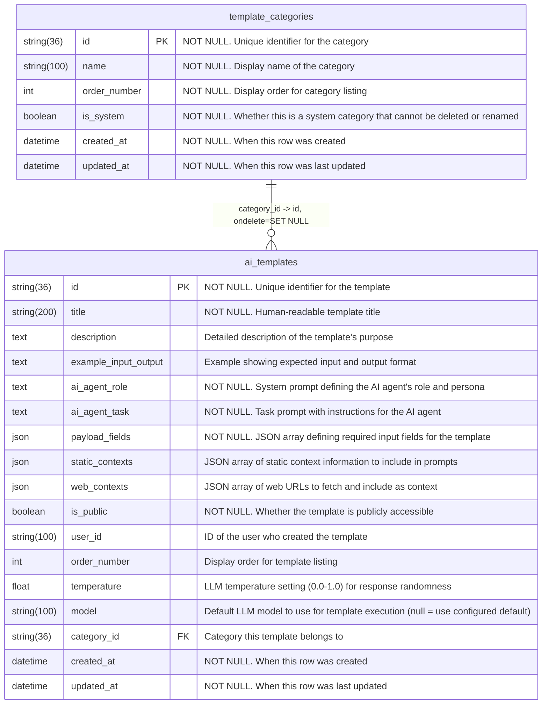
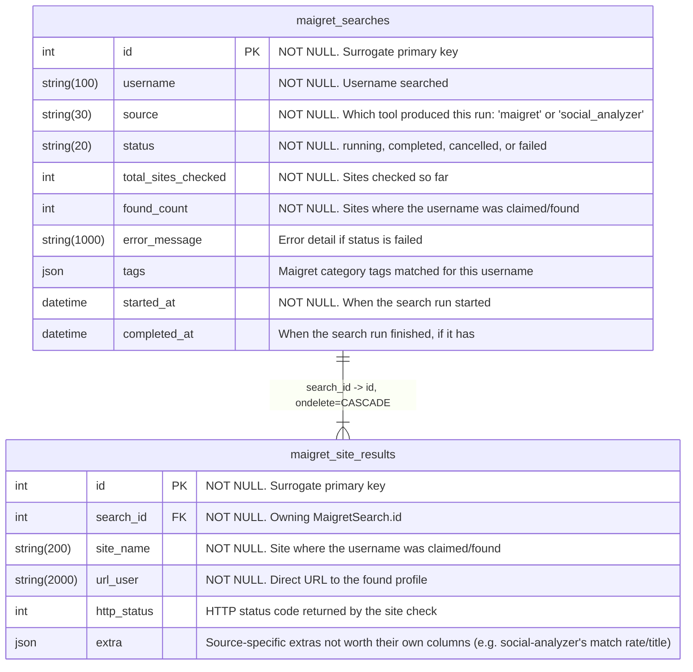
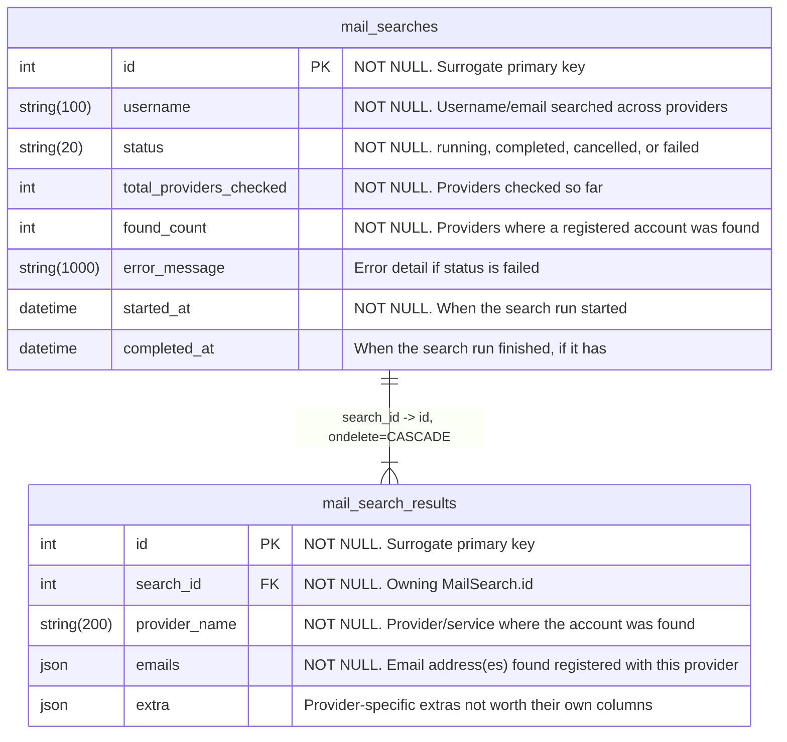
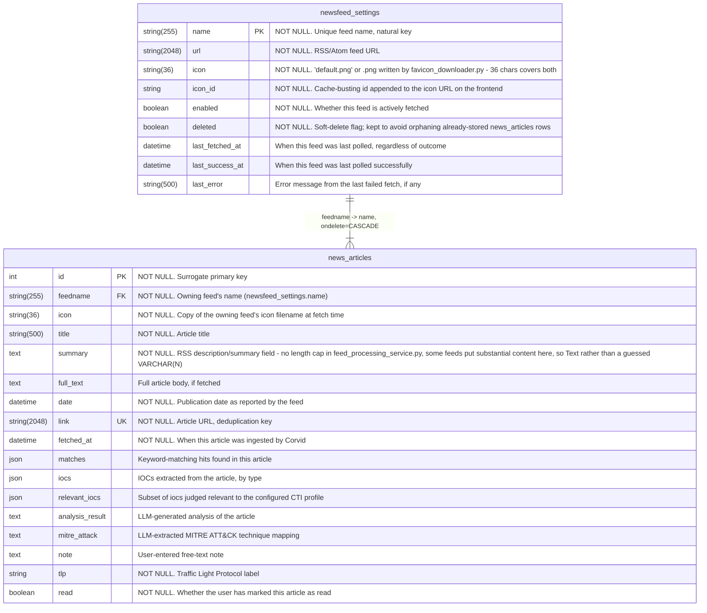
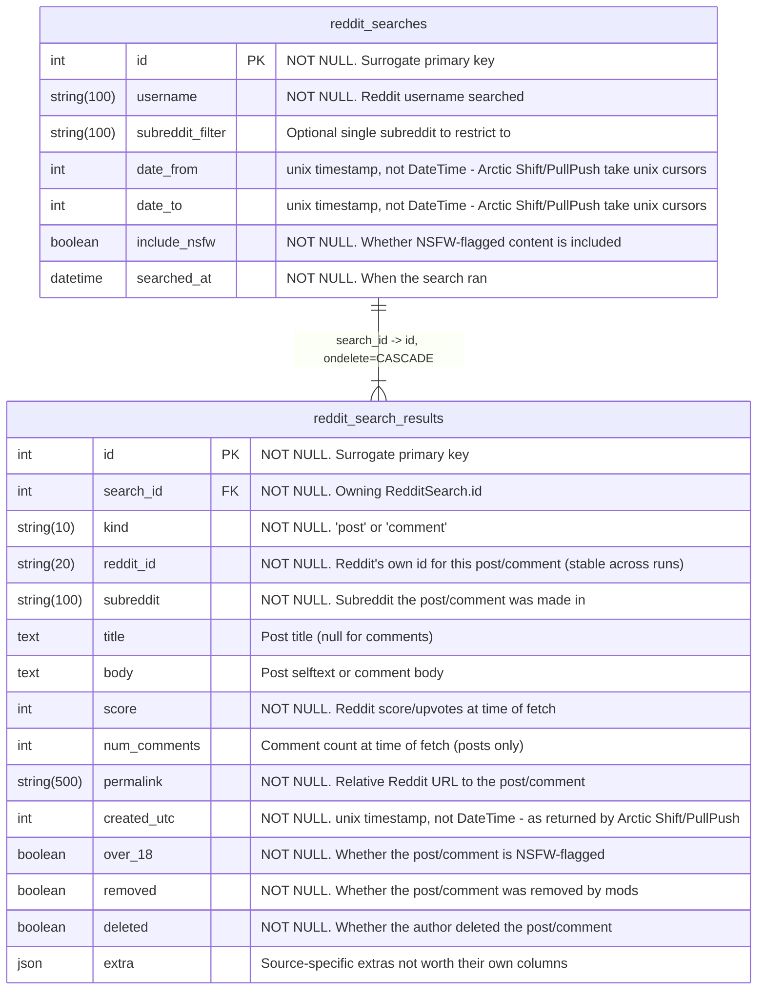
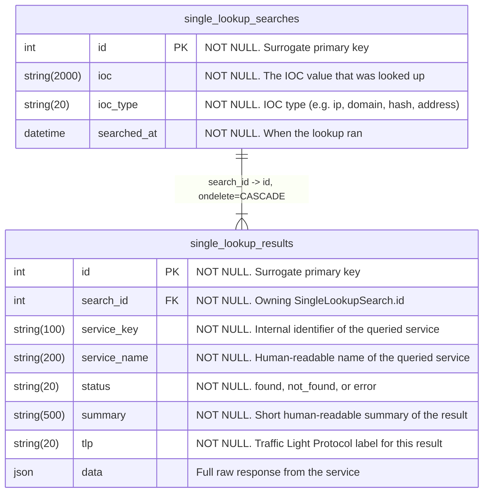

<!-- AUTO-GENERATED by `python backend/scripts/generate_db_docs.py` — do not edit by hand. -->
<!-- See docs/database-schema-audit.md section 4 (phases 4.1/4.2) for how this is produced. -->

# Database Schema

## Entity-Relationship Diagrams

One diagram per group of tables connected by a foreign key. Tables with no FK relationships at all aren't shown here - Mermaid's layout has nothing to anchor disconnected entities to, so they'd end up as a wide row of boxes rather than a readable graph. Every table, related or not, is listed in the Data Dictionary below.

## Data Dictionary

Every column of every table, straight from `Base.metadata` - type, nullability, default, key (PK/FK/UK), and the `comment=` set on the model.

### `ai_settings`

| Column | Type | Nullable | Default | Key | Comment |
|---|---|---|---|---|---|
| `id` | int | no | — | PK | Singleton row id, always 1 |
| `default_model` | string(80) | no | 'gpt-5' | — | Fallback LLM model id used when a feature has no override set |
| `newsfeed_analysis_model` | string(80) | yes | — | — | LLM model override for newsfeed article analysis; null = use default_model |
| `newsfeed_report_model` | string(80) | yes | — | — | LLM model override for newsfeed report generation; null = use default_model |
| `email_analyzer_model` | string(80) | yes | — | — | LLM model override for email search analysis; null = use default_model |
| `llm_templates_model` | string(80) | yes | — | — | LLM model override for AI template execution; null = use default_model |
| `image_geolocation_model` | string(80) | yes | — | — | LLM model override for AI photo geolocation; null = use default_model |
| `created_at` | datetime | no | server: now() | — | When this row was created |
| `updated_at` | datetime | no | server: now() | — | When this row was last updated |

### `ai_templates`

| Column | Type | Nullable | Default | Key | Comment |
|---|---|---|---|---|---|
| `id` | string(36) | no | (computed) | PK | Unique identifier for the template |
| `title` | string(200) | no | — | — | Human-readable template title |
| `description` | text | yes | — | — | Detailed description of the template's purpose |
| `example_input_output` | text | yes | — | — | Example showing expected input and output format |
| `ai_agent_role` | text | no | — | — | System prompt defining the AI agent's role and persona |
| `ai_agent_task` | text | no | — | — | Task prompt with instructions for the AI agent |
| `payload_fields` | json | no | — | — | JSON array defining required input fields for the template |
| `static_contexts` | json | yes | (computed) | — | JSON array of static context information to include in prompts |
| `web_contexts` | json | yes | (computed) | — | JSON array of web URLs to fetch and include as context |
| `is_public` | boolean | no | False | — | Whether the template is publicly accessible |
| `user_id` | string(100) | yes | — | — | ID of the user who created the template |
| `order_number` | int | yes | 0 | — | Display order for template listing |
| `temperature` | float | yes | 0.7 | — | LLM temperature setting (0.0-1.0) for response randomness |
| `model` | string(100) | yes | — | — | Default LLM model to use for template execution (null = use configured default) |
| `category_id` | string(36) | yes | — | FK | Category this template belongs to |
| `created_at` | datetime | no | server: now() | — | When this row was created |
| `updated_at` | datetime | no | server: now() | — | When this row was last updated |

### `alerts`

| Column | Type | Nullable | Default | Key | Comment |
|---|---|---|---|---|---|
| `id` | int | no | — | PK | Surrogate primary key |
| `module` | string(100) | no | — | — | Feature/module that raised this alert |
| `title` | string(200) | no | — | — | Short alert headline |
| `message` | string(1000) | no | — | — | Full alert body text |
| `read` | boolean | no | False | — | Whether the user has dismissed/read this alert |
| `timestamp` | datetime | no | server: now() | — | When the alert was raised |
| `timestamp_read` | datetime | yes | — | — | When the alert was marked as read, if it has been |

### `apikeys`

| Column | Type | Nullable | Default | Key | Comment |
|---|---|---|---|---|---|
| `name` | string(100) | no | — | PK | Unique name of the API key provider |
| `key` | text | no | '' | — | The API key value (encrypted at rest) |
| `is_active` | boolean | no | False | — | Whether the key is active for use |
| `bulk_ioc_lookup` | boolean | no | False | — | Whether bulk lookup is enabled |
| `created_at` | datetime | no | server: now() | — | When this row was created |
| `updated_at` | datetime | no | server: now() | — | When this row was last updated |

### `blacklisted_addresses`

| Column | Type | Nullable | Default | Key | Comment |
|---|---|---|---|---|---|
| `id` | int | no | — | PK | Surrogate primary key |
| `address` | string(128) | no | — | — | Blockchain address or IOC value |
| `source` | string(20) | no | — | — | Feed this entry came from: 'OFAC' or 'SCAMSNIFFER' |
| `chain` | string(20) | yes | — | — | Blockchain the address belongs to, if known |
| `label` | string(255) | yes | — | — | Short human-readable label for the entry |
| `entity_name` | string(255) | yes | — | — | Sanctioned/flagged entity name, if known |
| `details` | json | yes | — | — | Raw source-specific feed record |
| `is_active` | boolean | no | True | — | Whether the entry is still present in the source feed |
| `first_seen_at` | datetime | no | server: now() | — | When this entry was first ingested |
| `last_seen_at` | datetime | no | server: now() | — | When this entry was last seen in a feed refresh |

- CHECK `ck_blacklisted_addresses_source`: `source IN ('OFAC', 'SCAMSNIFFER')`

### `cti_profile_settings`

| Column | Type | Nullable | Default | Key | Comment |
|---|---|---|---|---|---|
| `id` | int | no | — | PK | Singleton row id, always 1 |
| `settings_data` | json | no | — | — | Free-form CTI profile config (sectors, regions, keywords, etc.) |
| `created_at` | datetime | no | server: now() | — | When this row was created |
| `updated_at` | datetime | no | server: now() | — | When this row was last updated |

### `email_search_config`

| Column | Type | Nullable | Default | Key | Comment |
|---|---|---|---|---|---|
| `id` | int | no | — | PK | Singleton row id, always 1 |
| `timeout_seconds` | int | no | 10 | — | Per-provider check timeout, in seconds |
| `max_concurrency` | int | no | 10 | — | Max number of providers checked in parallel |
| `proxy_url` | string(500) | yes | — | — | Optional HTTP(S) proxy URL for provider checks |
| `use_tor` | boolean | no | False | — | Whether to route checks through Tor |
| `enable_smtp_checks` | boolean | no | False | — | Whether to run SMTP-based mailbox existence checks |
| `enable_headless_checks` | boolean | no | False | — | Whether to run headless-browser-based provider checks |
| `latest_pypi_version` | string(50) | yes | — | — | Latest version seen on PyPI for the vendored tool, cached from the last check |
| `pypi_checked_at` | datetime | yes | — | — | When latest_pypi_version was last refreshed |
| `created_at` | datetime | no | server: now() | — | When this row was created |
| `updated_at` | datetime | no | server: now() | — | When this row was last updated |

### `general_settings`

| Column | Type | Nullable | Default | Key | Comment |
|---|---|---|---|---|---|
| `id` | int | no | — | PK | Singleton row id, always 1 |
| `darkmode` | boolean | no | False | — | Whether the UI theme is dark mode |
| `language` | string(5) | no | 'en' | — | UI language code (e.g. 'en', 'ru') |
| `auto_open_on_single_match` | boolean | no | True | — | Whether to auto-open the result when a search returns exactly one match |
| `start_screen` | string(20) | no | 'search' | — | Which screen the app opens on startup |
| `always_tiles` | boolean | no | False | — | Whether to always use tile layout instead of tabs |
| `created_at` | datetime | no | server: now() | — | When this row was created |
| `updated_at` | datetime | no | server: now() | — | When this row was last updated |

### `git_recon_searches`

| Column | Type | Nullable | Default | Key | Comment |
|---|---|---|---|---|---|
| `id` | int | no | — | PK | Surrogate primary key |
| `mode` | string(20) | no | — | — | gitcolombo scan mode (e.g. 'user', 'org', 'repo') |
| `target` | string(300) | no | — | — | GitHub user/org/repo that was scanned |
| `status` | string(20) | no | 'completed' | — | running, completed, cancelled, or failed |
| `error` | text | yes | — | — | Error detail if status is failed |
| `repos_scanned` | int | no | 0 | — | Repositories successfully scanned |
| `repos_failed` | int | no | 0 | — | Repositories that failed to scan |
| `persons_found` | int | no | 0 | — | Distinct identities correlated |
| `searched_at` | datetime | no | server: now() | — | When the search ran |
| `result` | json | yes | — | — | Full gitcolombo result blob - no normalized result table, see database-schema-audit.md #12 |

### `keywords`

| Column | Type | Nullable | Default | Key | Comment |
|---|---|---|---|---|---|
| `id` | int | no | — | PK | Surrogate primary key |
| `keyword` | string(100) | no | — | UK | Watched keyword, lowercased/stripped by validate_keyword |
| `created_at` | datetime | no | server: now() | — | When this row was created |
| `updated_at` | datetime | no | server: now() | — | When this row was last updated |

### `maigret_searches`

| Column | Type | Nullable | Default | Key | Comment |
|---|---|---|---|---|---|
| `id` | int | no | — | PK | Surrogate primary key |
| `username` | string(100) | no | — | — | Username searched |
| `source` | string(30) | no | 'maigret' | — | Which tool produced this run: 'maigret' or 'social_analyzer' |
| `status` | string(20) | no | 'running' | — | running, completed, cancelled, or failed |
| `total_sites_checked` | int | no | 0 | — | Sites checked so far |
| `found_count` | int | no | 0 | — | Sites where the username was claimed/found |
| `error_message` | string(1000) | yes | — | — | Error detail if status is failed |
| `tags` | json | yes | — | — | Maigret category tags matched for this username |
| `started_at` | datetime | no | server: now() | — | When the search run started |
| `completed_at` | datetime | yes | — | — | When the search run finished, if it has |

- CHECK `ck_maigret_searches_status`: `status IN ('running', 'completed', 'cancelled', 'failed')`

### `maigret_site_results`

| Column | Type | Nullable | Default | Key | Comment |
|---|---|---|---|---|---|
| `id` | int | no | — | PK | Surrogate primary key |
| `search_id` | int | no | — | FK | Owning MaigretSearch.id |
| `site_name` | string(200) | no | — | — | Site where the username was claimed/found |
| `url_user` | string(2000) | no | — | — | Direct URL to the found profile |
| `http_status` | int | yes | — | — | HTTP status code returned by the site check |
| `extra` | json | yes | — | — | Source-specific extras not worth their own columns (e.g. social-analyzer's match rate/title) |

### `mail_search_results`

| Column | Type | Nullable | Default | Key | Comment |
|---|---|---|---|---|---|
| `id` | int | no | — | PK | Surrogate primary key |
| `search_id` | int | no | — | FK | Owning MailSearch.id |
| `provider_name` | string(200) | no | — | — | Provider/service where the account was found |
| `emails` | json | no | — | — | Email address(es) found registered with this provider |
| `extra` | json | yes | — | — | Provider-specific extras not worth their own columns |

### `mail_searches`

| Column | Type | Nullable | Default | Key | Comment |
|---|---|---|---|---|---|
| `id` | int | no | — | PK | Surrogate primary key |
| `username` | string(100) | no | — | — | Username/email searched across providers |
| `status` | string(20) | no | 'running' | — | running, completed, cancelled, or failed |
| `total_providers_checked` | int | no | 0 | — | Providers checked so far |
| `found_count` | int | no | 0 | — | Providers where a registered account was found |
| `error_message` | string(1000) | yes | — | — | Error detail if status is failed |
| `started_at` | datetime | no | server: now() | — | When the search run started |
| `completed_at` | datetime | yes | — | — | When the search run finished, if it has |

- CHECK `ck_mail_searches_status`: `status IN ('running', 'completed', 'cancelled', 'failed')`

### `module_settings`

| Column | Type | Nullable | Default | Key | Comment |
|---|---|---|---|---|---|
| `name` | string(100) | no | — | PK | Module identifier; 100 matches MODULE_NAME_MAX_LENGTH in config/default_settings.py |
| `enabled` | boolean | no | True | — | Whether this module is enabled and visible in the UI |
| `created_at` | datetime | no | server: now() | — | When this row was created |
| `updated_at` | datetime | no | server: now() | — | When this row was last updated |

### `news_articles`

| Column | Type | Nullable | Default | Key | Comment |
|---|---|---|---|---|---|
| `id` | int | no | — | PK | Surrogate primary key |
| `feedname` | string(255) | no | — | FK | Owning feed's name (newsfeed_settings.name) |
| `icon` | string(36) | no | — | — | Copy of the owning feed's icon filename at fetch time |
| `title` | string(500) | no | — | — | Article title |
| `summary` | text | no | — | — | RSS description/summary field - no length cap in feed_processing_service.py, some feeds put substantial content here, so Text rather than a guessed VARCHAR(N) |
| `full_text` | text | yes | — | — | Full article body, if fetched |
| `date` | datetime | no | — | — | Publication date as reported by the feed |
| `link` | string(2048) | no | — | UK | Article URL, deduplication key |
| `fetched_at` | datetime | no | (computed) | — | When this article was ingested by Corvid |
| `matches` | json | yes | — | — | Keyword-matching hits found in this article |
| `iocs` | json | yes | — | — | IOCs extracted from the article, by type |
| `relevant_iocs` | json | yes | — | — | Subset of iocs judged relevant to the configured CTI profile |
| `analysis_result` | text | yes | — | — | LLM-generated analysis of the article |
| `mitre_attack` | text | yes | — | — | LLM-extracted MITRE ATT&CK technique mapping |
| `note` | text | yes | — | — | User-entered free-text note |
| `tlp` | string | no | 'TLP:CLEAR' | — | Traffic Light Protocol label |
| `read` | boolean | no | False | — | Whether the user has marked this article as read |

### `newsfeed_config`

| Column | Type | Nullable | Default | Key | Comment |
|---|---|---|---|---|---|
| `id` | int | no | — | PK | Singleton row id, always 1 |
| `retention_days` | int | no | 0 | — | Days to keep articles before pruning; 0 = keep forever |
| `background_fetch_enabled` | boolean | no | True | — | Whether the scheduler job fetches feeds automatically |
| `fetch_interval_minutes` | int | no | 60 | — | Minutes between scheduled feed fetches |
| `last_fetch_timestamp` | datetime | yes | — | — | When the background fetch job last ran, across all feeds |
| `keyword_matching_enabled` | boolean | no | False | — | Whether articles are matched against the configured keyword list |

### `newsfeed_settings`

| Column | Type | Nullable | Default | Key | Comment |
|---|---|---|---|---|---|
| `name` | string(255) | no | — | PK | Unique feed name, natural key |
| `url` | string(2048) | no | — | — | RSS/Atom feed URL |
| `icon` | string(36) | no | 'default.png' | — | 'default.png' or <uuid4().hex>.png written by favicon_downloader.py - 36 chars covers both |
| `icon_id` | string | no | (computed) | — | Cache-busting id appended to the icon URL on the frontend |
| `enabled` | boolean | no | True | — | Whether this feed is actively fetched |
| `deleted` | boolean | no | False | — | Soft-delete flag; kept to avoid orphaning already-stored news_articles rows |
| `last_fetched_at` | datetime | yes | — | — | When this feed was last polled, regardless of outcome |
| `last_success_at` | datetime | yes | — | — | When this feed was last polled successfully |
| `last_error` | string(500) | yes | — | — | Error message from the last failed fetch, if any |

### `reddit_search_results`

| Column | Type | Nullable | Default | Key | Comment |
|---|---|---|---|---|---|
| `id` | int | no | — | PK | Surrogate primary key |
| `search_id` | int | no | — | FK | Owning RedditSearch.id |
| `kind` | string(10) | no | — | — | 'post' or 'comment' |
| `reddit_id` | string(20) | no | — | — | Reddit's own id for this post/comment (stable across runs) |
| `subreddit` | string(100) | no | — | — | Subreddit the post/comment was made in |
| `title` | text | yes | — | — | Post title (null for comments) |
| `body` | text | yes | — | — | Post selftext or comment body |
| `score` | int | no | 0 | — | Reddit score/upvotes at time of fetch |
| `num_comments` | int | yes | — | — | Comment count at time of fetch (posts only) |
| `permalink` | string(500) | no | — | — | Relative Reddit URL to the post/comment |
| `created_utc` | int | no | — | — | unix timestamp, not DateTime - as returned by Arctic Shift/PullPush |
| `over_18` | boolean | no | False | — | Whether the post/comment is NSFW-flagged |
| `removed` | boolean | no | False | — | Whether the post/comment was removed by mods |
| `deleted` | boolean | no | False | — | Whether the author deleted the post/comment |
| `extra` | json | yes | — | — | Source-specific extras not worth their own columns |

### `reddit_searches`

| Column | Type | Nullable | Default | Key | Comment |
|---|---|---|---|---|---|
| `id` | int | no | — | PK | Surrogate primary key |
| `username` | string(100) | no | — | — | Reddit username searched |
| `subreddit_filter` | string(100) | yes | — | — | Optional single subreddit to restrict to |
| `date_from` | int | yes | — | — | unix timestamp, not DateTime - Arctic Shift/PullPush take unix cursors |
| `date_to` | int | yes | — | — | unix timestamp, not DateTime - Arctic Shift/PullPush take unix cursors |
| `include_nsfw` | boolean | no | True | — | Whether NSFW-flagged content is included |
| `searched_at` | datetime | no | server: now() | — | When the search ran |

### `ru_business_check_searches`

| Column | Type | Nullable | Default | Key | Comment |
|---|---|---|---|---|---|
| `id` | int | no | — | PK | Surrogate primary key |
| `query` | string(500) | no | — | — | Raw user input - ИНН or company/IP name |
| `resolved_inn` | string(12) | yes | — | — | Resolved ИНН, once the ЕГРЮЛ lookup matches a single entity |
| `entity_type` | string(30) | yes | — | — | 'legal_entity' or 'individual_entrepreneur', once resolved |
| `status` | string(20) | no | 'running' | — | running, completed, cancelled, or failed |
| `error` | text | yes | — | — | Error detail if status is failed |
| `searched_at` | datetime | no | server: now() | — | When the scan started |
| `completed_at` | datetime | yes | — | — | When the scan reached a terminal state - the report's 'as of' date |
| `egrul_data` | json | yes | — | — | Parsed ЕГРЮЛ/ЕГРИП fields (name, address, director, founders, ОКВЭД, capital, registry status) |
| `egrul_raw` | text | yes | — | — | Verbatim ЕГРЮЛ payload (search-result JSON + extracted PDF text) as received from egrul.nalog.ru |
| `disqualification_result` | json | yes | — | — | РДЛ check result: {checked, matched, requires_manual_review, matches: [...]} |
| `disqualification_raw` | text | yes | — | — | Verbatim РДЛ payload as received from service.nalog.ru/disqualified.do |
| `arbitration_data` | json | yes | — | — | Arbitration case list: {checked, cases: [{case_number, date_registered, role, status, court, claim_amount, case_url}]} |
| `arbitration_raw` | text | yes | — | — | Verbatim arbitration search-result payload as received from kad.arbitr.ru |
| `fedresurs_data` | json | yes | — | — | Bankruptcy check result: {checked, found, status_text, is_active_bankruptcy, profile_url} |
| `fedresurs_raw` | text | yes | — | — | Verbatim bankruptcy search-result payload as received from fedresurs.ru |
| `pb_nalog_data` | json | yes | — | — | Прозрачный бизнес result: {checked, found, mass_address_count, mass_address_companies, profile_url} |
| `pb_nalog_raw` | text | yes | — | — | Verbatim search+detail payload as received from pb.nalog.ru |
| `fedsfm_result` | json | yes | — | — | ФедСФМ (терроризм/финансирование ОМУ) check result: {checked, matched, requires_manual_review, matches: [...]} |
| `fedsfm_raw` | text | yes | — | — | Verbatim ФедСФМ payload as received from fedsfm.ru/TerroristSearch |
| `website` | string(255) | yes | — | — | Optional company website, user-supplied - display-only, not analyzed by this feature itself; the UI links it out to domain_finder's own WHOIS/DNS/CT analysis instead of duplicating it here |
| `rnp_data` | json | yes | — | — | РНП (реестр недобросовестных поставщиков) check result: {checked, entries: [{registry_number, law, name, inn, included_date, updated_date, planned_exclusion_date, status, eruz_number, detail_url}]} |
| `rnp_raw` | text | yes | — | — | Verbatim RSS payload as received from zakupki.gov.ru |
| `flags` | json | yes | — | — | List of {code, severity, title, detail} risk flags |
| `risk_level` | string(10) | yes | — | — | low, medium, or high - based only on checked_sources, never implies full-methodology coverage |
| `checked_sources` | json | yes | — | — | Source keys actually queried this scan, snapshotted at scan time |
| `pending_sources` | json | yes | — | — | Source keys not yet available this stage, snapshotted at scan time |
| `candidates` | json | yes | — | — | Brief per-entity info when the query matched multiple ЕГРЮЛ/ЕГРИП rows (name search) - empty once resolved to a single entity |

### `ru_business_check_settings`

| Column | Type | Nullable | Default | Key | Comment |
|---|---|---|---|---|---|
| `id` | int | no | — | PK | Singleton row id, always 1 |
| `fresh_registration_threshold_days` | int | no | 365 | — | Registration age below which the soft 'fresh registration' flag fires |
| `history_retention_days` | int | no | 90 | — | Days a search (including its raw scraped payloads) is kept before automatic deletion; 0 = unlimited |
| `small_claim_amount_threshold` | int | no | 100000 | — | Claim amount (RUB) below which a single resolved arbitration case as defendant is a soft flag |
| `large_claim_amount_threshold` | int | no | 1000000 | — | Claim amount (RUB) above which any arbitration case as defendant triggers the 'significant claims' soft flag |
| `multiple_claims_defendant_threshold` | int | no | 3 | — | Number of arbitration cases as defendant at/above which the 'multiple claims' soft flag fires |
| `mass_address_threshold` | int | no | 10 | — | Number of other entities registered at the same address (pb.nalog.ru) at/above which the 'mass registration address' soft flag fires |

### `single_lookup_results`

| Column | Type | Nullable | Default | Key | Comment |
|---|---|---|---|---|---|
| `id` | int | no | — | PK | Surrogate primary key |
| `search_id` | int | no | — | FK | Owning SingleLookupSearch.id |
| `service_key` | string(100) | no | — | — | Internal identifier of the queried service |
| `service_name` | string(200) | no | — | — | Human-readable name of the queried service |
| `status` | string(20) | no | — | — | found, not_found, or error |
| `summary` | string(500) | no | — | — | Short human-readable summary of the result |
| `tlp` | string(20) | no | — | — | Traffic Light Protocol label for this result |
| `data` | json | yes | — | — | Full raw response from the service |

### `single_lookup_searches`

| Column | Type | Nullable | Default | Key | Comment |
|---|---|---|---|---|---|
| `id` | int | no | — | PK | Surrogate primary key |
| `ioc` | string(2000) | no | — | — | The IOC value that was looked up |
| `ioc_type` | string(20) | no | — | — | IOC type (e.g. ip, domain, hash, address) |
| `searched_at` | datetime | no | server: now() | — | When the lookup ran |

### `social_analyzer_config`

| Column | Type | Nullable | Default | Key | Comment |
|---|---|---|---|---|---|
| `id` | int | no | — | PK | Singleton row id, always 1 |
| `timeout_seconds` | int | no | 0 | — | Per-site check timeout, in seconds (0 = no timeout) |
| `top_sites_count` | int | no | 0 | — | Max number of top sites to scan (0 = scan all sites) |
| `latest_pypi_version` | string(50) | yes | — | — | Latest version seen on PyPI for the vendored tool, cached from the last check |
| `pypi_checked_at` | datetime | yes | — | — | When latest_pypi_version was last refreshed |
| `created_at` | datetime | no | server: now() | — | When this row was created |
| `updated_at` | datetime | no | server: now() | — | When this row was last updated |

### `template_categories`

| Column | Type | Nullable | Default | Key | Comment |
|---|---|---|---|---|---|
| `id` | string(36) | no | (computed) | PK | Unique identifier for the category |
| `name` | string(100) | no | — | — | Display name of the category |
| `order_number` | int | no | 0 | — | Display order for category listing |
| `is_system` | boolean | no | False | — | Whether this is a system category that cannot be deleted or renamed |
| `created_at` | datetime | no | server: now() | — | When this row was created |
| `updated_at` | datetime | no | server: now() | — | When this row was last updated |

### `trends_blacklist`

| Column | Type | Nullable | Default | Key | Comment |
|---|---|---|---|---|---|
| `id` | int | no | — | PK | Surrogate primary key |
| `value` | string(255) | no | — | — | Blacklisted word or IOC value, lowercased |
| `type` | string(10) | no | — | — | 'word' or 'ioc' |
| `created_at` | datetime | no | server: now() | — | When this entry was added |

- CHECK `ck_trends_blacklist_type`: `type IN ('word', 'ioc')`

### `username_search_config`

| Column | Type | Nullable | Default | Key | Comment |
|---|---|---|---|---|---|
| `id` | int | no | — | PK | Singleton row id, always 1 |
| `timeout_seconds` | int | no | 30 | — | Per-site check timeout, in seconds |
| `max_concurrency` | int | no | 100 | — | Max number of sites checked in parallel |
| `top_sites_count` | int | no | 500 | — | Max number of top sites to scan (0 = scan all sites) |
| `proxy_url` | string(500) | yes | — | — | Optional HTTP(S) proxy URL for site checks |
| `auto_update_db_enabled` | boolean | no | True | — | Whether Maigret's site database is refreshed automatically on a schedule |
| `auto_update_interval_hours` | int | no | 24 | — | Hours between automatic site-database refreshes |
| `db_last_updated_at` | datetime | yes | — | — | When the Maigret site database was last refreshed |
| `db_site_count` | int | no | 0 | — | Number of sites in the current Maigret site database |
| `latest_pypi_version` | string(50) | yes | — | — | Latest version seen on PyPI for the vendored tool, cached from the last check |
| `pypi_checked_at` | datetime | yes | — | — | When latest_pypi_version was last refreshed |
| `created_at` | datetime | no | server: now() | — | When this row was created |
| `updated_at` | datetime | no | server: now() | — | When this row was last updated |
